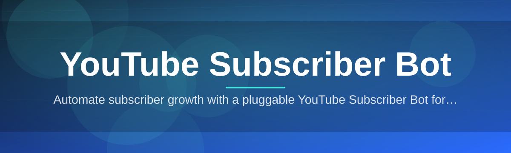
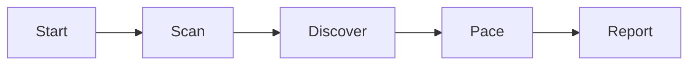

# subscriber-booster-tool 🚀📈

  

*A quiet little Windows app that helps small YouTube channels grow subscribers without the guesswork.*

## 👋 Overview

I built subscriber-booster-tool because I was tired of watching genuinely good channels stall out at double-digit subscriber counts while low-effort content sailed past them on momentum alone. This is a passion project, born out of my own frustration trying to grow a small channel — every "growth guide" I found online was either recycled SEO fluff or a paid subscription service that wanted my credit card before telling me anything useful. So I built the tool I wished existed.

At its core, this is a **YouTube Subscriber Bot** — a standalone Windows utility that automates the tedious, repetitive parts of subscriber outreach and channel discovery so creators can spend their energy on actual content instead of manually clicking through hundreds of channels a day. It sits quietly on your desktop, does its job in the background, and gives you clean reporting on what's actually happening with your growth curve.

This tool is for the solo creator, the small studio, and the hobbyist channel that doesn't have a marketing budget but still wants to compete on a level playing field. It's not magic, and it's not a shortcut around making good videos — but it removes the manual grind of channel discovery, engagement tracking, and subscriber funnel management that eats hours every week.

  

> [!NOTE]
> This project is under active, solo development. New builds ship regularly on the landing page — star the repo if you want to keep tabs on progress.

---

## 🧩 The Problem, and Why This Fixes It

Growing a YouTube channel used to mean one of three things: buying ads you couldn't afford, begging for shoutouts, or spending every evening manually browsing similar channels hoping someone would subscribe back. None of that scales, and all of it is exhausting.

subscriber-booster-tool replaces that grind with a structured, automated workflow: it identifies relevant channels in your niche, manages engagement in a way that respects rate limits, and reports real numbers back to you — no spreadsheets, no guesswork, no burnout.

---

## ⚙️ What It Actually Does

- **Niche-Aware Targeting** — the tool profiles your channel's category and tags, then focuses discovery on genuinely relevant audiences instead of blasting randomly.

- **Adaptive Pacing Engine** — built-in throttling mimics natural usage patterns, spacing out actions instead of firing them in suspicious bursts.

- **Live Growth Dashboard** — a clean in-app panel tracks subscriber deltas, session activity, and daily trends without needing a browser tab open.

- **Session Scheduling** — set run windows so the tool works during hours that make sense for your audience's timezone, then stops itself automatically.

- **Lightweight Footprint** — a single portable executable, no background services, no bloated installer, no telemetry phoning home.

- **Session Logs & Export** — every run produces a readable log you can export as CSV for your own records or channel analytics.

- **Safety-First Defaults** — conservative rate limits out of the box, with advanced users able to tune behavior manually in Settings.

- **One-Click Pause/Resume** — stop everything instantly with a single hotkey if you need to step away.

---

## 🏁 How To Get Started

> [!TIP]
> The whole setup takes less than two minutes — no accounts, no configuration wizards, no nonsense.

1. **Visit the landing page** using the download button above or below.

2. **Download the latest build** — it's a single standalone `.exe`, no bundled installer junk.

3. **Run the application** — Windows may show a SmartScreen prompt for unsigned apps; click "More info" → "Run anyway".

4. **Sign in through the in-app browser panel**, set your niche preferences, and hit Start.

---

## 💻 System Requirements

| Requirement | Details |
|---|---|
| OS | Windows 10 or Windows 11 (64-bit) |
| Dependencies | None — fully standalone |
| Disk Space | ~80 MB |
| RAM | 2 GB minimum, 4 GB recommended |
| Internet | Stable broadband connection |
| Admin Rights | Not required for normal use |

  

---

## 🔍 How It Works

The architecture is intentionally simple — a single-process desktop app with a lightweight scheduling core:

1. **Profile Scan** — reads your channel's metadata to understand niche and content type.

2. **Discovery Pass** — builds a queue of relevant channels based on that profile.

3. **Pacing Engine** — throttles and schedules actions to stay within natural, human-like limits.

4. **Execution Loop** — runs the queued actions during your configured active window.

5. **Reporting** — logs results to the dashboard and exports them on request.

> [!IMPORTANT]
> The pacing engine is not optional — it exists to keep activity looking organic, and disabling it in Settings is strongly discouraged.

---

## 🛟 Troubleshooting

**Q: The app won't launch — Windows says it's from an unknown publisher.**
A: This is standard SmartScreen behavior for indie-signed apps. Click "More info" → "Run anyway" to proceed.

**Q: My subscriber count isn't moving as fast as expected.**
A: Growth is intentionally gradual by design — the pacing engine prioritizes account safety over speed. Check the dashboard trend graph over a 7-day window, not hour by hour.

**Q: The session log shows fewer actions than I scheduled.**
A: Some skips are expected — the tool automatically skips channels that don't meet relevance thresholds to avoid wasted actions.

**Q: Can I run this on a laptop that sleeps overnight?**
A: Yes, but scheduled sessions will pause during sleep and resume automatically once the machine wakes.

**Q: Is there a Mac or Linux version?**
A: Not currently — this build targets Windows 10/11 only. It's on the long-term roadmap.

**Q: The dashboard numbers look different from YouTube Studio.**
A: YouTube Studio has reporting delays of up to 48 hours; the in-app dashboard reflects real-time session data instead.

---

## 🎨 UI / UX Details

<strong>Keyboard Shortcuts</strong>

| Shortcut | Action |
|---|---|
| `Ctrl + Space` | Pause / Resume active session |
| `Ctrl + L` | Open session logs |
| `Ctrl + E` | Export logs to CSV |
| `Ctrl + ,` | Open Settings |
| `Esc` | Minimize to tray |

<strong>Themes</strong>

- Midnight (default dark theme)

- Daylight (light theme)

- Contrast (high-contrast accessibility theme)

<strong>Settings Highlights</strong>

> [!WARNING]
> Manually overriding the Adaptive Pacing Engine to run faster than default is possible in Advanced Settings, but not recommended — it increases the risk of odd behavior on your account.

- Active hours scheduler

- Niche keyword override

- Export format (CSV / JSON)

- Session notification toggle

---

## 🤝 Contributing & Community

This started as a solo passion project, but it's grown well beyond what I expected — and I'd love help making it better.

- Open an issue for bugs or feature requests

- Fork the repo and submit a pull request for fixes or improvements

- Join discussions in the Issues tab to share feedback on the roadmap

> [!NOTE]
> Even small contributions — typo fixes, documentation cleanup, translation help — are genuinely appreciated. This is a community project now, not just mine.

---

## 📄 License

Released under the [MIT License](LICENSE), 2026.

---

## ⚠️ Disclaimer

This tool is provided for educational and personal channel-growth purposes. It automates repetitive discovery and engagement tasks but does not guarantee specific results, as subscriber growth depends on many factors including content quality, platform policies, and audience behavior. Use responsibly and in accordance with YouTube's Terms of Service. The developer assumes no liability for account actions taken as a result of using this software.

  

